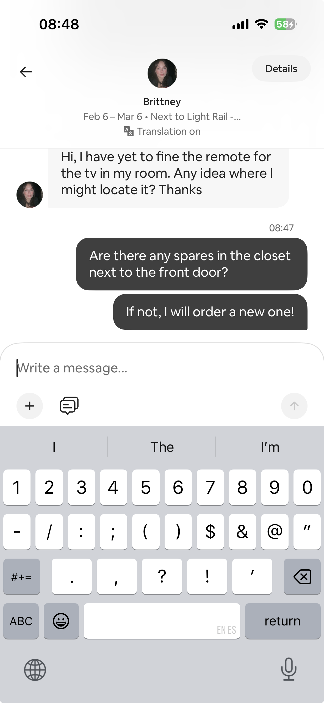
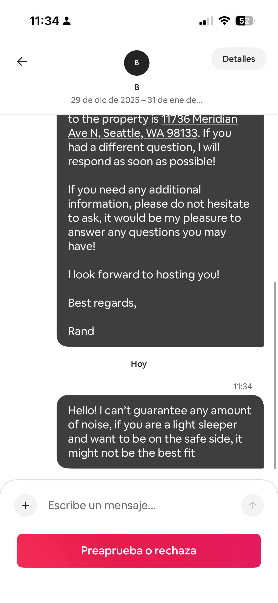
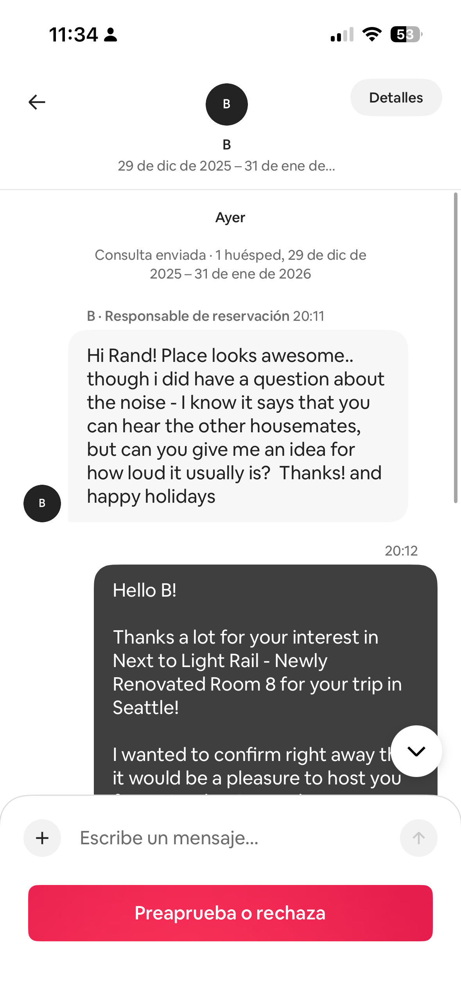

# Guest Communication

## Remote control lost

1. Ask them to check out stock in front door closet 
2. If none there, order new ones and ask Christina to restock location
3. Let guest know when restocked

## Booking Request

- Read their booking request message, clear up any details
- Make sure the price is reasonable (Compare with daily price from year before)
- Look at their profile reviews, if anything bad, decline.
- If no reviews, read booking request details. Accept if student or traveling nurse, otherwise reject
- If name is likely a problem, decline.

## Thermostat question

## Query about parking and safety

## Query about deals, special prices etc

Answer: we do not provide deals outside of our booking platform pricing.

## Query about noise level

## Code is not working

- Make sure they are inputting it correctly
- Most of the time it is user error

## Query: layout of the house

- Asked about if a room shares a wall
- is the downstairs a basement

## Request to switch rooms

Tell them to request alteration request and change rooms if it’s before their reservation starts

If reservation started, tell them to shorten current stay and to book the other room

## Toilet clogged

Screenshot message from guest and just pass it along to Christina 

When done, Zelle the cost to Christina, TODo: set up a set amount for her

## New Code request

Edit code in hospitable (click edit)

## Someone checking in and out on same day

If they want cleaning, then continue with cleaning

Otherwise, cancel cleaning

I usually let Christina mark as complete and take the payment anyways

- Let them know to be careful to not lock themselves out when their codes change.
- If they do lock themselves out, provide a backup code via hospitable (TODO: Loom video How-to)

## Alteration request

Usually always accept alteration requests, only exceptions are if they have been a bad guest then you have to come up with an excuse why you can extend, only has happened once or twice

If they ask, direct them to create a request

## Cleaning Complaint

- Send the messages to Christina’s group chat

## Is washer and dryer available in the house query

Answer: Yes
